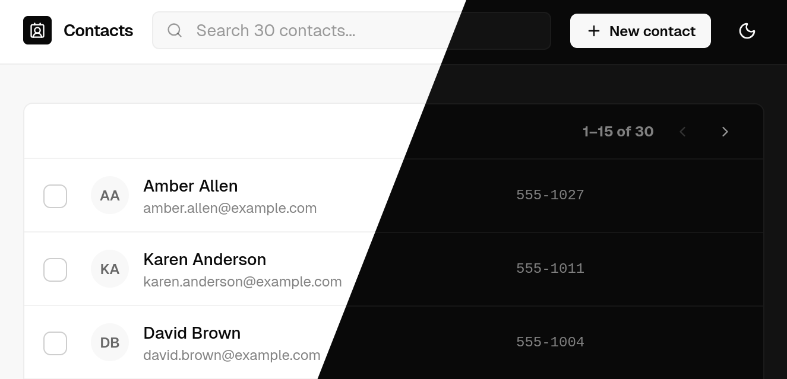

# Contacts

[](https://github.com/yamcodes/contact.app)



A contact management app built with Spring Boot, Thymeleaf, and htmx.

## Overview

This app follows the architecture from [Hypermedia Systems](https://hypermedia.systems/part/htmx/) - same ideas, different tech stack (Spring Boot + Thymeleaf instead of Python and Flask).

- HTML is rendered on the server with Thymeleaf templates
- htmx handles partial page updates via AJAX via [`htmx-spring-boot-thymeleaf`](https://github.com/wimdeblauwe/htmx-spring-boot)
- No full page reloads for most interactions
- No client-side JavaScript framework (just htmx attributes)

## Features

- List and search contacts (with instant filtering via htmx)
- Add, edit, and delete contact details
- Server-rendered HTML with Thymeleaf
- Partial page updates (no full reloads)
- PostgreSQL + Spring Data JPA + Flyway migrations

## Development

### Prerequisites

- Java 25
- Docker (for local Postgres)

### Setup

1. **Create `src/main/resources/application-local.yaml`** (gitignored — never committed):

```yaml
spring:
  security:
    user:
      name: <your-username>
      password: <your-password>
  datasource:
    url: jdbc:postgresql://localhost:5432/contacts
    username: contacts
    password: contacts
  jpa:
    hibernate:
      ddl-auto: validate
  sql:
    init:
      mode: always
  thymeleaf:
    cache: false
    prefix: file:src/main/resources/templates/
  devtools:
    livereload:
      enabled: true
    restart:
      additional-paths: src/main/resources/templates/
      additional-exclude: "**/*.html"
  web:
    resources:
      static-locations:
        - file:src/main/resources/static/
        - classpath:/static/
      cache:
        period: 0
      chain:
        cache: false
```

2. **Start Postgres:**

```bash
./scripts/start-db.sh
```

3. **Run the app:**

```bash
./mvnw spring-boot:run -Dspring-boot.run.profiles=local
```

### IntelliJ IDEA

1. **Open** - **File → Open**, select `pom.xml`, choose **"Open as Project"**
2. **Java 25 SDK** - **File → Project Structure → SDKs**, add Java 25 if missing (IntelliJ can download it)
3. **Lombok** - install the [Lombok plugin](https://plugins.jetbrains.com/plugin/6317-lombok) via **Settings → Plugins**, then enable annotation processing under **Settings → Build, Execution, Deployment → Compiler → Annotation Processors**
4. **Create `application-local.yaml`** - see [Setup](#setup) above
5. **Run** - use the included **Development** compound run configuration from the toolbar — it starts Docker, waits for Postgres, then launches the app

**Tips:**

- Spring Boot DevTools (already included) enables hot reload - recompile with `Ctrl+F9` without restarting
- Enable **"Build project automatically"** (**Settings → Build, Execution, Deployment → Compiler**) and **"Allow auto-make to start even if developed application is currently running"** (**Settings → Advanced Settings**) for seamless reloads on save
- Thymeleaf templates hot-reload without a restart

### Scripts

| Command                                                   | Description          |
| --------------------------------------------------------- | -------------------- |
| `./scripts/start-db.sh`                                   | Start local Postgres |
| `docker compose down`                                     | Stop local Postgres  |
| `./mvnw spring-boot:run -Dspring-boot.run.profiles=local` | Start dev server     |
| `./mvnw test`                                             | Run tests            |
| `./mvnw package`                                          | Build jar            |

## Project structure

```
src/
├── main/
│   ├── java/codes/yam/contacts/
│   │   ├── ContactsApplication.java     # Entry point
│   │   ├── ContactController.java       # All /contacts routes
│   │   ├── Contact.java                 # JPA entity (id, slug, first, last, email, phone)
│   │   ├── ContactRepository.java       # Spring Data JPA (search, pagination)
│   │   └── ContactService.java          # Validation, slug generation, business logic
│   └── resources/
│       ├── db/migration/
│       │   └── V1__init.sql             # Initial schema (Flyway)
│       ├── templates/
│       │   ├── layout.html              # Base layout (Thymeleaf fragment)
│       │   ├── contacts/
│       │   │   ├── list.html            # GET /contacts
│       │   │   ├── view.html            # GET /contacts/{slug}
│       │   │   ├── new.html             # GET /contacts/new
│       │   │   └── edit.html            # GET /contacts/{slug}/edit
│       │   ├── error/
│       │   │   └── 404.html             # 404 not found page
│       │   └── fragments/
│       │       ├── contact-fields.html  # Reusable form fields (htmx partial)
│       │       └── contact-rows.html    # Table rows (htmx partial for search/pagination)
│       ├── static/
│       │   ├── styles.css
│       │   └── img/
│       │       └── spinning-circles.svg # Loading spinner
│       ├── application.yaml             # Production config (env var placeholders)
│       ├── application-local.yaml       # Local overrides — gitignored, never committed
│       └── data.sql                     # Seed data (local only)
├── test/
│   └── java/codes/yam/contacts/
│       ├── controller/
│       │   └── ContactControllerTest.java
│       └── service/
│           └── ContactServiceTest.java
scripts/
└── start-db.sh                          # docker compose up + wait for Postgres readiness
docker-compose.yml                       # Local Postgres service
```

### Routes

| Method   | Path                     | Description                         |
| -------- | ------------------------ | ----------------------------------- |
| `GET`    | `/`                      | Redirect to `/contacts`             |
| `GET`    | `/contacts`              | List contacts (search + pagination) |
| `GET`    | `/contacts/new`          | New contact form                    |
| `POST`   | `/contacts`              | Create contact                      |
| `GET`    | `/contacts/{slug}`       | View contact                        |
| `GET`    | `/contacts/{slug}/edit`  | Edit contact form                   |
| `POST`   | `/contacts/{slug}/edit`  | Update contact                      |
| `DELETE` | `/contacts/{slug}`       | Delete contact                      |
| `DELETE` | `/contacts`              | Bulk delete contacts                |
| `GET`    | `/contacts/{slug}/email` | Inline email validation (htmx)      |
| `GET`    | `/contacts/count`        | Async contact count (htmx)          |

## Tech stack

| Layer      | Technology                                                                                               |
| ---------- | -------------------------------------------------------------------------------------------------------- |
| Language   | Java 25                                                                                                  |
| Framework  | [Spring Boot](https://spring.io/projects/spring-boot) 4.0.3                                              |
| Templating | [Thymeleaf](https://www.thymeleaf.org)                                                                   |
| Hypermedia | [htmx](https://htmx.org) + [htmx-spring-boot-thymeleaf](https://github.com/wimdeblauwe/htmx-spring-boot) |
| Database   | PostgreSQL + Spring Data JPA                                                                             |
| Migrations | [Flyway](https://flywaydb.org)                                                                           |
| Build      | Maven                                                                                                    |

## Branches

This repo tracks the evolution of the app across different stacks - earlier branches used [Hono](https://hono.dev/) (a TypeScript web framework), while `main` is the current Spring Boot implementation.

| Branch                                                                         | Summary                       | Description                                                                                                 |
| ------------------------------------------------------------------------------ | ----------------------------- | ----------------------------------------------------------------------------------------------------------- |
| [`hono-web1`](https://github.com/yamcodes/contact.app/tree/hono-web1)          | Hypermedia-Driven Application | Server-rendered HTML using links and forms. Full page reloads. Pure hypermedia, no client-side JS.          |
| [`hono`](https://github.com/yamcodes/contact.app/tree/hono)                    | HDA + HTMX                    | Same architecture as `hono-web1`, enhanced with HTMX for partial updates without JSON or client-side state. |
| [`hono-eta`](https://github.com/yamcodes/contact.app/tree/hono-eta)            | HDA (Eta templates)           | Same architecture as `hono-web1`, using string-based Eta templates instead of JSX.                          |
| **[`main`](https://github.com/yamcodes/contact.app/tree/main)** (You're here!) | **HDA + Spring Boot**         | **Same architecture, rewritten in Java with Spring Boot, Thymeleaf, and htmx-spring-boot.**                 |

## License

MIT
